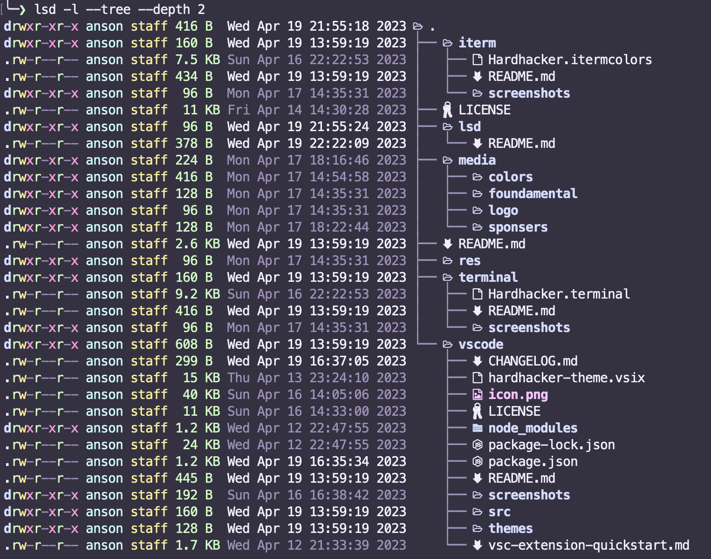

<p align="center">
  
</p>

<h1 align="center">
  HardHacker Theme for LSD
</h1>

[LSD](https://github.com/lsd-rs/lsd)



## Install

1. Before use this theme, you need to install HardHacker Theme into your terminal first.
2. Download or clone this repo.
3. Copy `hardhacker.yaml` to `~/.config/lsd/themes/`.
4. Edit `~/.config/lsd/config.yaml`, create it if doesn't exist.
```yaml
color:
  theme: hardhacker
```

For more information please check [lsd](https://github.com/lsd-rs/lsd#configuration).
